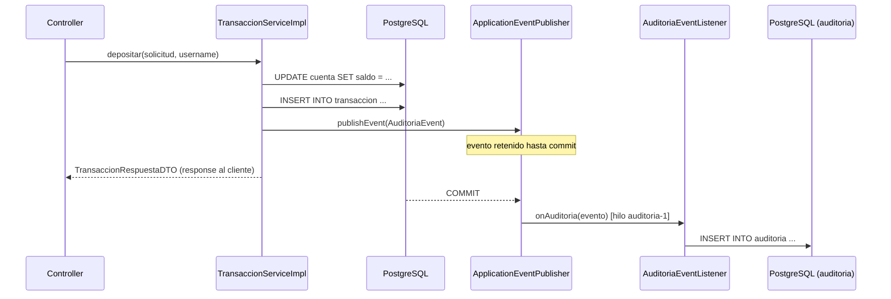

# Asincronismo — Banco Digital

> **Patrón:** Event-Driven con `ApplicationEventPublisher` de Spring + `@Async`
> **Propósito:** desacoplar el registro de auditoría del flujo principal de las transacciones

---

## Motivación

Cada transacción (depósito, retiro, transferencia) debe dejar un registro en la tabla `auditoria`. Sin asincronismo, ese registro se haría dentro de la misma transacción de base de datos que mueve el dinero — lo que acopla dos responsabilidades distintas y agrega latencia innecesaria al response del cliente.

Con el patrón evento + listener asíncrono:
- La transacción financiera se completa y hace commit.
- El registro de auditoría ocurre **después del commit**, en un hilo separado.
- Si la auditoría falla, **no hace rollback** del dinero ya movido.

---

## Componentes

### 1. `@EnableAsync` — habilitación global

**Archivo:** `BancoDigitalApplication.java`

```java
@SpringBootApplication
@EnableAsync
public class BancoDigitalApplication { ... }
```

Activa el soporte de Spring para métodos anotados con `@Async`. Sin esta anotación, `@Async` es ignorado silenciosamente.

---

### 2. `ConfiguracionAsync` — pool de hilos dedicado

**Archivo:** `config/ConfiguracionAsync.java`

```java
@Bean(name = "executorAuditoria")
public Executor executorAuditoria() {
    ThreadPoolTaskExecutor ejecutor = new ThreadPoolTaskExecutor();
    ejecutor.setCorePoolSize(2);    // hilos siempre activos
    ejecutor.setMaxPoolSize(5);     // máximo bajo carga
    ejecutor.setQueueCapacity(100); // cola antes de rechazar
    ejecutor.setThreadNamePrefix("auditoria-");
    ejecutor.initialize();
    return ejecutor;
}
```

La auditoría corre en su propio pool (`auditoria-1`, `auditoria-2`, …) aislado del pool HTTP de Tomcat. Esto evita que un pico de auditoría agote los hilos que atienden requests.

---

### 3. `AuditoriaEvent` — el evento

**Archivo:** `event/AuditoriaEvent.java`

```java
public class AuditoriaEvent extends ApplicationEvent {
    private final String accion;   // "DEPOSITO", "RETIRO", "TRANSFERENCIA"
    private final Long idUsuario;  // FK → usuario que ejecutó la acción
    private final String detalle;  // descripción legible
}
```

Extiende `ApplicationEvent` de Spring. Es un objeto de valor inmutable — solo transporta datos, no hace nada por sí mismo.

---

### 4. `AuditoriaEventListener` — el consumidor asíncrono

**Archivo:** `listener/AuditoriaEventListener.java`

```java
@Async("executorAuditoria")
@Transactional
@TransactionalEventListener(phase = TransactionPhase.AFTER_COMMIT)
public void onAuditoria(AuditoriaEvent evento) {
    Auditoria auditoria = new Auditoria();
    auditoria.setAccion(evento.getAccion());
    auditoria.setDetalle(evento.getDetalle());
    auditoria.setUsuario(usuarioRepository.findById(evento.getIdUsuario()).orElseThrow());
    auditoriaRepository.save(auditoria);
}
```

Las tres anotaciones trabajan en conjunto:

| Anotación | Qué hace |
|---|---|
| `@TransactionalEventListener(phase = AFTER_COMMIT)` | Solo ejecuta si la transacción del publicador hizo **commit** exitosamente. Si hubo rollback, el evento se descarta. |
| `@Async("executorAuditoria")` | Corre el método en el pool `executorAuditoria`, no en el hilo del request HTTP. |
| `@Transactional` | Abre una **nueva** transacción de BD para guardar el registro de auditoría. |

---

### 5. Publicación del evento — en `TransaccionServiceImpl`

El `Service` publica el evento al final de cada operación exitosa, antes de retornar el DTO:

```java
eventPublisher.publishEvent(new AuditoriaEvent(this, "DEPOSITO",
        usuario.getIdUsuario(),
        "Depósito de " + monto + " en cuenta " + cuenta.getNumeroCuenta()));
```

Spring retiene el evento hasta que la transacción hace commit (`AFTER_COMMIT`), luego despacha al listener.

---

## Flujo completo



El response al cliente llega **antes** de que la auditoría se escriba en BD.

---

## `RegistroFalloService` — transacciones fallidas

**Archivo:** `service/RegistroFalloService.java`

Complementa el asincronismo con un mecanismo diferente: registrar transacciones que **fallaron** (saldo insuficiente, cuenta bloqueada).

```java
@Transactional(propagation = Propagation.REQUIRES_NEW)
public void registrarFallo(Cuenta origen, Cuenta destino,
                           TipoTransaccion tipo, BigDecimal monto) { ... }
```

`REQUIRES_NEW` abre una transacción completamente independiente de la transacción padre. Esto garantiza que el registro del fallo se persiste en BD **aunque la transacción padre haga rollback**.

Flujo cuando hay un error:

```
retirar() [transacción padre]
  └─ saldo insuficiente detectado
       ├─ registroFalloService.registrarFallo() [transacción NUEVA → commit propio]
       └─ throw SaldoInsuficienteException → rollback padre
```

---

## Estructura de carpetas — paquetes nuevos

```
src/main/java/fe/banco_digital/
│
├── config/
│   └── ConfiguracionAsync.java    ← pool de hilos para auditoría
│
├── event/
│   └── AuditoriaEvent.java        ← objeto de evento (dato puro)
│
├── listener/
│   └── AuditoriaEventListener.java ← consumidor asíncrono del evento
│
└── service/
    └── RegistroFalloService.java  ← registra transacciones fallidas (REQUIRES_NEW)
```

---

## Reglas del equipo

- Nunca publicar un `AuditoriaEvent` dentro de un método sin `@Transactional` — el `AFTER_COMMIT` nunca dispararía.
- No agregar lógica de negocio al `AuditoriaEventListener` — solo mapear y persistir.
- Si se necesita auditar una acción nueva, publicar un `AuditoriaEvent` desde el Service correspondiente; no crear listeners nuevos para el mismo propósito.
- El `RegistroFalloService` es exclusivo para transacciones financieras fallidas — no reutilizar para otros fines.
