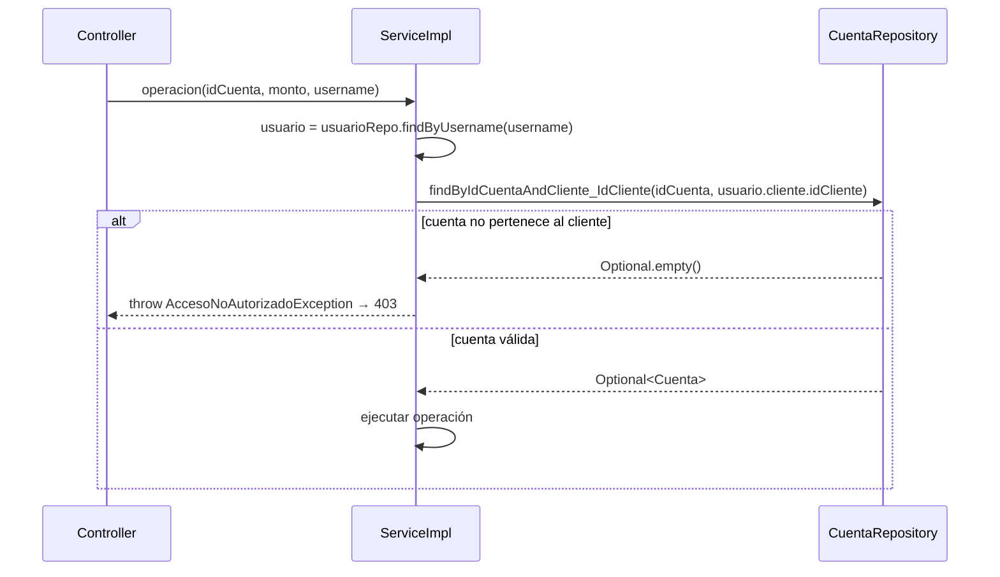

# Endpoints — contrato de datos y origen del token

> Este documento define, para cada endpoint protegido, **qué datos se extraen del JWT** y qué datos llegan por body o path.

---

## Principio general

Todos los endpoints bajo `/api/v1/` requieren un JWT en el header `Authorization: Bearer <token>`.

Spring extrae el `username` del token mediante `@AuthenticationPrincipal UserDetails`. El controller **nunca** recibe el ID del usuario, del cliente ni de la cuenta del propio usuario como parámetro: siempre se deriva del token dentro del service.

```
JWT → username → usuarioRepo.findByUsername() → usuario.getCliente().getIdCliente()
```

---

## Tabla de endpoints protegidos

| Método | Endpoint | Del token | Del request | ¿Verifica propiedad? |
|--------|----------|-----------|-------------|----------------------|
| `PUT` | `/api/v1/clientes/me` | `username` → `idCliente` | body: `email`, `telefono` | N/A — el token **es** la identidad |
| `GET` | `/api/v1/cuentas/dashboard` | `username` → `idCliente` | — | N/A — devuelve solo sus cuentas |
| `PATCH` | `/api/v1/cuentas/cerrar` | `username` → `idCliente` | body: `idCuenta`, `contrasena` | Sí — `findByIdCuentaAndCliente_IdCliente` |
| `POST` | `/api/v1/cuentas/seguridad/bloquear` | `username` → cuenta activa del cliente | body: `password` | N/A — busca la cuenta del propio cliente |
| `POST` | `/api/v1/cuentas/seguridad/desbloquear` | `username` → cuenta bloqueada del cliente | body: `password` | N/A — busca la cuenta del propio cliente |
| `POST` | `/api/v1/transacciones/depositar` | `username` → `idCliente` | body: `idCuenta`, `monto` | Sí — `findByIdCuentaAndCliente_IdCliente` |
| `POST` | `/api/v1/transacciones/retirar` | `username` → `idCliente` | body: `idCuenta`, `monto` | Sí — `findByIdCuentaAndCliente_IdCliente` |
| `POST` | `/api/v1/transacciones/transferir` | `username` → `idCliente` | body: `idCuentaOrigen`, `numeroCuentaDestino`, `monto` | Sí — verifica que `idCuentaOrigen` pertenece al cliente |
| `GET` | `/api/v1/transacciones/cuenta/{idCuenta}` | `username` → `idCliente` | path: `idCuenta` | Sí — `findByIdCuentaAndCliente_IdCliente` |
| `GET` | `/api/v1/transacciones/cuenta/{idCuenta}/filtro` | `username` → `idCliente` | path: `idCuenta`, params: `fechaInicio`, `fechaFin` | Sí — `findByIdCuentaAndCliente_IdCliente` |

---

## Categorías de extracción del token

### Categoría A — el token es la única fuente de identidad

El endpoint no recibe ningún ID de usuario, cliente ni cuenta propia. El service resuelve todo desde el `username`:

| Endpoint | Qué se deriva del token |
|----------|------------------------|
| `PUT /api/v1/clientes/me` | `idCliente` completo |
| `GET /api/v1/cuentas/dashboard` | `idCliente` → lista de cuentas |
| `POST /api/v1/cuentas/seguridad/bloquear` | cuenta activa del cliente |
| `POST /api/v1/cuentas/seguridad/desbloquear` | cuenta bloqueada del cliente |

**Por qué:** el usuario solo puede operar sobre sus propios recursos, y como solo tiene un cliente asociado, no hace falta que especifique cuál.

### Categoría B — el token valida la propiedad de un recurso externo

El request indica **qué recurso** operar (p.ej. `idCuenta`), y el service verifica que ese recurso pertenece al cliente del token:

| Endpoint | ID recibido | Verificación en service |
|----------|-------------|------------------------|
| `PATCH /api/v1/cuentas/cerrar` | `idCuenta` (body) | `findByIdCuentaAndCliente_IdCliente(idCuenta, idCliente)` |
| `POST /api/v1/transacciones/depositar` | `idCuenta` (body) | `findByIdCuentaAndCliente_IdCliente(idCuenta, idCliente)` |
| `POST /api/v1/transacciones/retirar` | `idCuenta` (body) | `findByIdCuentaAndCliente_IdCliente(idCuenta, idCliente)` |
| `POST /api/v1/transacciones/transferir` | `idCuentaOrigen` (body) | `findByIdCuentaAndCliente_IdCliente(idOrigen, idCliente)` |
| `GET /api/v1/transacciones/cuenta/{idCuenta}` | `idCuenta` (path) | `findByIdCuentaAndCliente_IdCliente(idCuenta, idCliente)` |
| `GET /api/v1/transacciones/cuenta/{idCuenta}/filtro` | `idCuenta` (path) | `findByIdCuentaAndCliente_IdCliente(idCuenta, idCliente)` |

**Por qué se acepta `idCuenta` en el request aquí:** un cliente puede tener múltiples cuentas y debe poder elegir sobre cuál operar. El `idCuenta` no es un ID de identidad — es la selección del recurso a operar. El service garantiza que la cuenta elegida pertenece al cliente del token; si no, devuelve 403.

---

## Antipatrón que NO se hace (IDOR)

```
# ❌ NUNCA — el ID del cliente en el path o body
PUT /api/v1/clientes/42          → cualquier usuario puede intentar editar al cliente 42
POST /depositar { "idUsuario": 42, "idCuenta": 7 }  → ID de usuario innecesario y peligroso

# ✅ CORRECTO
PUT /api/v1/clientes/me          → el "42" lo resuelve el service desde el token
POST /depositar { "idCuenta": 7 }  → el service verifica que la cuenta 7 sea del token
```

Si el service recibe un `id` externo que identifica al propio usuario/cliente, **siempre** debe compararlo contra el que viene del token y lanzar `AccesoNoAutorizadoException` (→ HTTP 403) si no coinciden.

---

## Flujo de verificación de propiedad (Categoría B)


